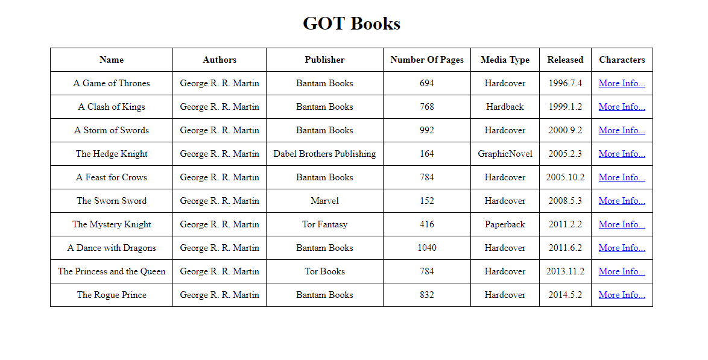
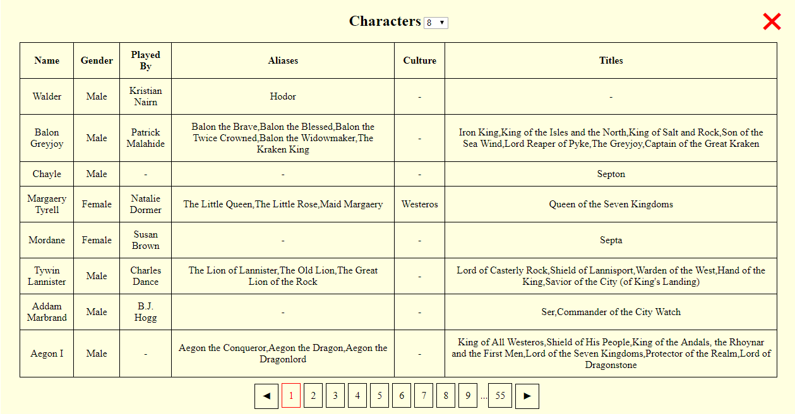

# "Game of Thrones" table with books

### This is an example of using the MVP pattern in JS to work with the API and display information in a table

I used the API from [ API Game of thrones books ](https://anapioficeandfire.com "link to API")

I used library for queries to API [axios](https://github.com/axios/axios "link to axios")

